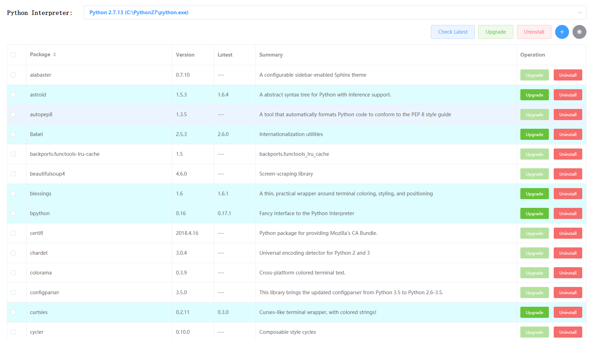
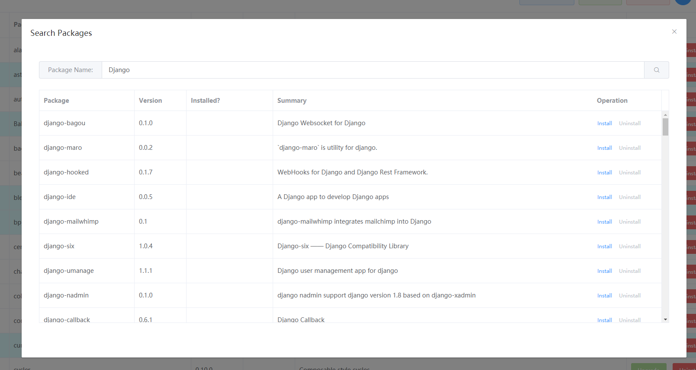

# 网页版 Python 包管理器

> A web Python package manager built using Django and Vue.

## 部署 (Deploy)

1. `pip install -r requirements.txt`
2. `npm install`
3. `python manage.py runserver 8000`

Then, visit: http://127.0.0.1:8000/

## 界面截图 (Screenshots)

### Manager UI

### Search Packages UI

## License

[MIT LICENSE](LICENSE)
